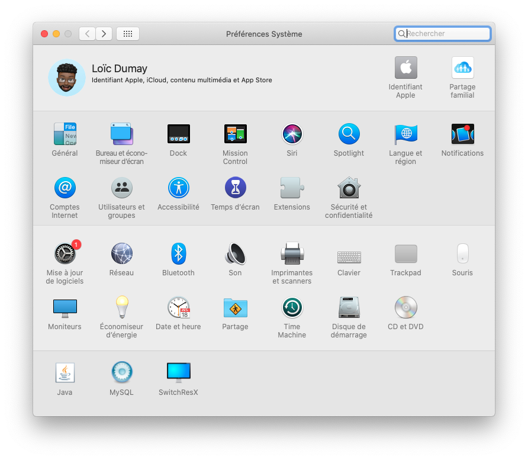
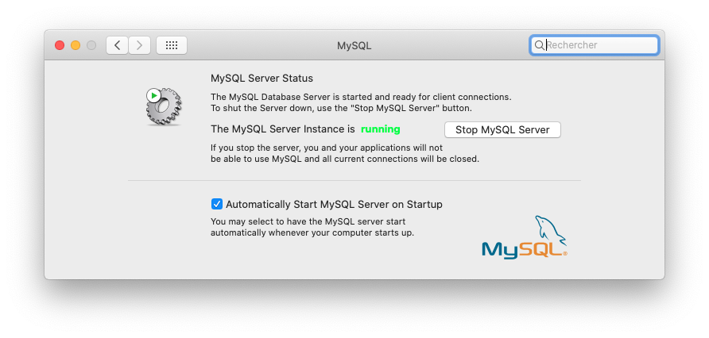

# Installer un serveur MySQL sur MacOS

[<== Retour](./)

## MySQL Server - Installation

Lien pour téléchargé MySQL Community Server :

- [MySQL Product Archives](https://downloads.mysql.com/archives/community/)

Choisissez une version au formation `.dmg` tel que : `mysql-8.0.27-macos11-x86_64.dmg`.

Puis, suivez les instructions.

Voici ce que vous obtiendrez à la fin.




*Version installée : 5.7.31*

## MySQL Server - Finalisé l'installation

Command pour se connecté au serveur MySQL :

```
mysql
```

OU

```
sudo mysql
```

> PS : `sudo` permet d'effectuer n'importe quel commande en tant qu'utilisateur `root`.

Si vous obtenez :

- `Access denied for user 'user'@'localhost' (using password: NO)`
 
OU

- `Access denied for user 'root'@'localhost' (using password: NO)`

Il est nécesssaire de se connecté au serveur MySQL en tant qu'utilisateur `root` du serveur, tel que :
 
```
mysql -u root -p
```

> Si vous avez ce message : `zsh: command not found: mysql`
> 
> Faites :
> 
> ```
> export PATH=${PATH}:/usr/local/mysql/bin/
> ```
> 
> Cela ajoutera la commande mysql à votre console.

Un mot de passe est demandé, veuillez saisir le mot de passe de l'utilisateur demandé (ici, il s'agit de `root`)

```
~ % mysql -u root -p
Enter password: 
```

> Si il s'agit de la 1er connexion, saisissez le mot de passe générer par Mysql Server.

Une fois connecté à mysql, vous devriez avoir cela :

```
Welcome to the MySQL monitor.  Commands end with ; or \g.
Your MySQL connection id is 78
Server version: 5.7.31 MySQL Community Server (GPL)

Copyright (c) 2000, 2020, Oracle and/or its affiliates. All rights reserved.

Oracle is a registered trademark of Oracle Corporation and/or its
affiliates. Other names may be trademarks of their respective
owners.

Type 'help;' or '\h' for help. Type '\c' to clear the current input statement.

mysql> 
```

Maitenant connecté, il est possible de changer le mot de passe de l'utilisateur `root` du serveur avec la requète SQL ci-dessous :

```
mysql> ALTER USER 'root'@'localhost' IDENTIFIED BY '<mot_de_passe_personnaliser>';
```

Une fois celle-ci effectué, on met à jour l'utilisateur.

```
mysql> flush privileges;
```

Tous est maintenant terminé, on peut ce déconnecté.

```
mysql> exit;
Bye
```

## MySQL Server - Remove MySQL completely

1. Open the Terminal
2. Use `mysqldump` to backup your databases
3. Check for MySQL processes with: `ps -ax | grep mysql`
4. Stop and kill any MySQL processes
5. Analyze MySQL on HomeBrew: 
        
	```
	brew remove mysql
	brew cleanup
	```

6. Remove files: 

    ```
    sudo rm /usr/local/mysql
    sudo rm -rf /usr/local/var/mysql
    sudo rm -rf /usr/local/mysql*
    sudo rm ~/Library/LaunchAgents/homebrew.mxcl.mysql.plist
    sudo rm -rf /Library/StartupItems/MySQLCOM
    sudo rm -rf /Library/PreferencePanes/My*
    ```

7. Unload previous MySQL Auto-Login: 
        
    ```
    launchctl unload -w ~/Library/LaunchAgents/homebrew.mxcl.mysql.plist
    ```
        
8. Remove previous MySQL Configuration: 

    ```
    # Edit this file: /etc/hostconfig
    # Remove the line MYSQLCOM=-YES-
    ```
        
9. Remove previous MySQL Preferences: 
    
    ```
    rm -rf ~/Library/PreferencePanes/My*
    sudo rm -rf /Library/Receipts/mysql*
    sudo rm -rf /Library/Receipts/MySQL*
    sudo rm -rf /private/var/db/receipts/*mysql*
    ```
    
10. Restart your computer just to ensure any MySQL processes are killed
11. Try to run mysql, **it shouldn't work**

